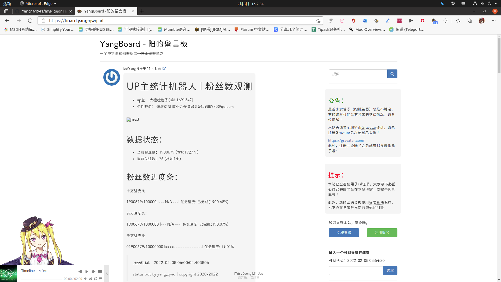

# 我的Pigeon模板

`Pigeon`是一个轻量化的留言板 / 记事本 / 社交系统 / 博客，当然，它的用途也不止这些

如果你不知道Pigeon是什么，请先前往[github源仓库](https://github.com/kasuganosoras/Pigeon/)看看

## 本模板的修改项

1. 加入了自定义音乐播放的功能(使用[Aplayer](https://github.com/DIYgod/APlayer/))，以及[Meting-js](https://github.com/metowolf/MetingJS)
2. 加入了自定义网页图标
3. 支持调用一言API
4. 改用国内的`Gravatar`镜像
5. 加入了看板娘（使用[live2d.min.js](https://github.com/stevenjoezhang/live2d-widget) 目前用的是公共cdn）
6. 引入了[sweetalert.js](http://lab.mkblog.cn/sweetalert/)
7. 自定义背景支持（需要手动修改源代码启用）

## 效果图

无背景，未登录

无背景，已登录

背景+高斯模糊（有fixed元素bug）

背景（无高斯模糊）

你还可以[查看demo](https://board.yang-qwq.ml/)

## 注意事项

1. 原作者的后端并没有提供公告、友链的接口，这个模块是直接改源码加上去的
2. 可以随意命名模板名称，不受限制（最好不要这么做，因为容易出问题）
3. 自定义网页图标请放入`./pigeon/template/<模板名称>/favicon.png`
4. 自定义播放列表请修改`<meting-js>`标签中的`id`、`server`和`type`属性
5. **本模板仅支持Pigeon v1.0.177**

**Tips:** 本人刚学php没多久，如有错误还请发issue！
